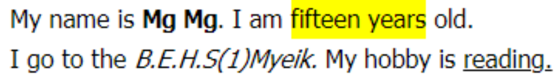
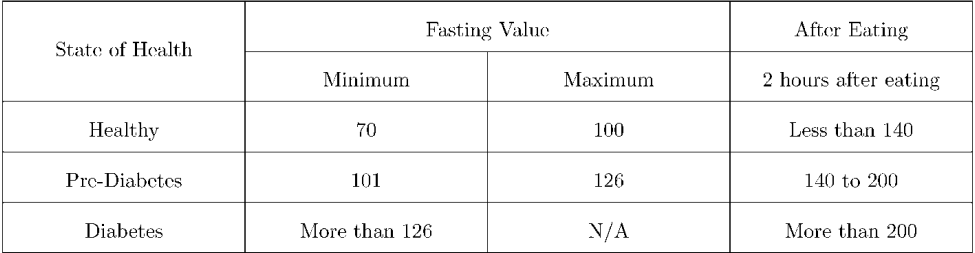

# Assignment 1
__16. Nov. 2021__

## HTML Assignment

Follow the instruction from `README.md` file and add file to this folder.

The example will be shown with `trainer_aungpaing.md` in this folder.

You can add file name as `student_your_name.md`

1. Write an anchor tag which links to [www.w3schools.com](www.w3schools.com).

2. Write an image tag which path is `D:\Nyein Chan Aung\WD4E\` and the image’s name is `assignment.jpg`.

3.  Which header tag produces the smallest size font for heading?
    - h6
    - h4
    - h1
    - h2
    
4.  Write html lists for the following picture.

5. Use appropriate text formatting tags for the following paragraph.

6.  Write complete html tags for the following table.

